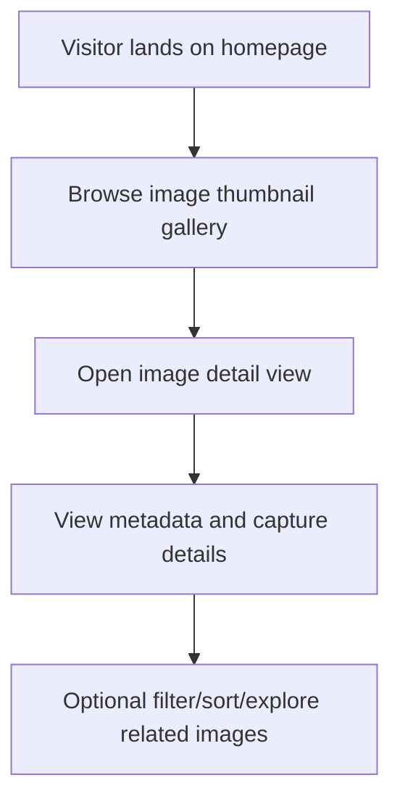
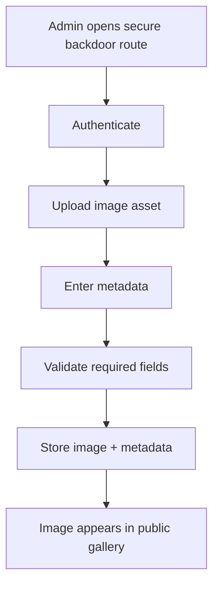
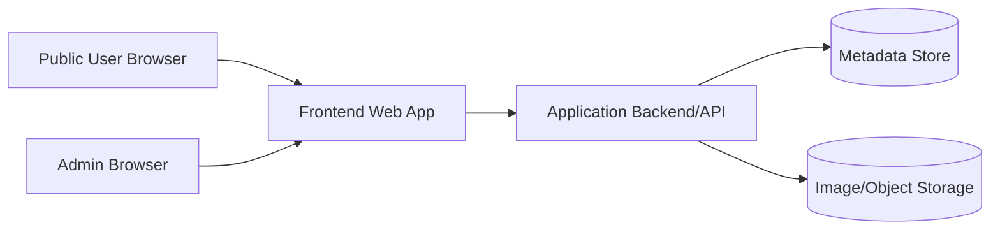

# images

Website project for showcasing astronomy photography with a public gallery experience and a secure admin upload workflow.

## Project status

See `WEBSITE_TASKS.md` for a full implementation plan covering:
- public thumbnail gallery
- secure admin upload backdoor
- equipment metadata capture
- visual wow-factor enhancements

## Deploying from GitHub

Use the following commands on your deployment machine.

### First-time setup (enable Git + get code)

```bash
# 1) Install Git if needed (Ubuntu/Debian)
sudo apt-get update
sudo apt-get install -y git

# 2) Verify Git is available
git --version

# 3) Clone the repository
git clone https://github.com/<your-org-or-user>/<your-repo>.git
cd <your-repo>
```

### If the project folder already exists but isn't a Git repo yet

```bash
cd /path/to/your/project
git init
git remote add origin https://github.com/<your-org-or-user>/<your-repo>.git
git fetch origin
git checkout -t origin/main
```

### Pull the latest code for updates

```bash
cd /path/to/your/project
git pull origin main
```

After pulling, run your normal build/restart steps for the web server or app process.
This repository is currently **planning-first** and documentation-driven.
Implementation priorities are tracked in `WEBSITE_TASKS.md` and parallelization ideas in `CODEX_PARALLEL_TASKS.md`.

## Goals

- Provide a visually compelling public gallery of astronomy images.
- Capture rich metadata (equipment, exposure, filters, location, etc.).
- Support a secure admin-only upload/backdoor path.
- Keep docs and implementation synchronized at all times.

## How the site is expected to work

### Public user journey



### Admin upload flow



### High-level architecture (target)



## Local development

Current repository contents are planning/documentation artifacts.
As implementation is added, keep this section updated with concrete setup commands (install, run, lint, test, build, deploy).

## Security notes

- Admin routes/backdoor functionality must require strong authentication.
- Upload endpoints should validate file type/size and sanitize metadata inputs.
- Avoid exposing privileged admin actions in public navigation.
- Document all security-relevant changes in the same PR as code changes.

## Repository map

- `README.md` — project overview, architecture, flows, and contributor expectations.
- `WEBSITE_TASKS.md` — detailed implementation plan for the website.
- `CODEX_PARALLEL_TASKS.md` — potential parallel tracks for execution.
- `AGENTS.md` — repository-level contributor/agent instructions and quality gates.

## Keeping docs in sync (required)

For **every** behavior-changing update:

1. Update `README.md` in the same commit.
2. Update Mermaid diagrams if flow/architecture changed.
3. Reflect new assumptions, env vars, security behavior, or operational steps.
4. Ensure task documents stay aligned with implementation status.

A code change without corresponding documentation updates is incomplete.
