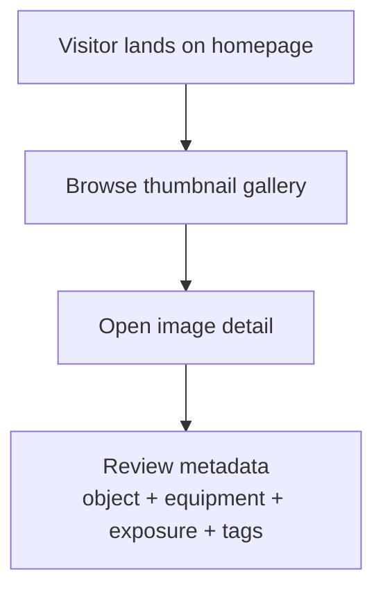
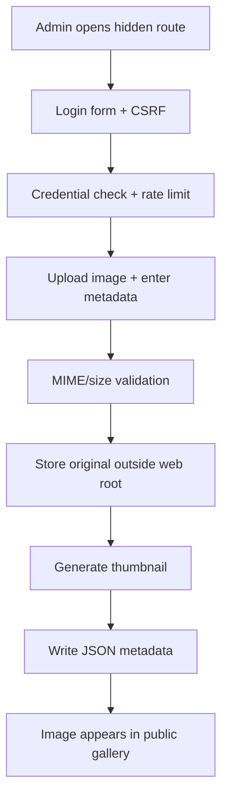
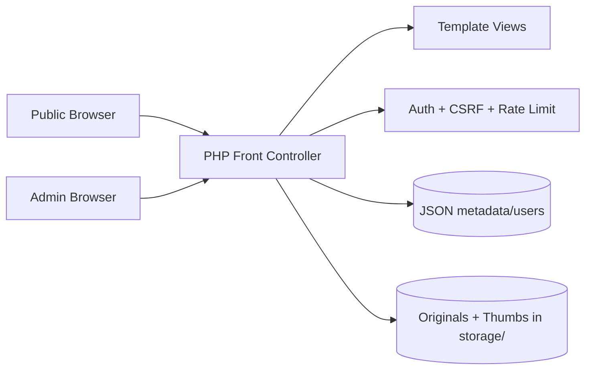

# images

Astronomy image showcase website with a public gallery and a secure admin upload backdoor, implemented with PHP + JSON storage for quick deployment on Apache.

## Project status

**Current maturity:** MVP implemented and runnable locally.

Implemented now:
- public gallery and image detail pages
- Repository intentionally does not include bundled `.jpg` sample images; upload your own media through the admin flow.
- metadata display (capture, equipment, exposure, processing, tags)
- secure admin route with session auth, CSRF protection, and basic login rate limiting
- image upload pipeline with MIME/size validation and thumbnail generation

Planned next:
- richer filtering/search, editing/deleting uploads, and stronger production hardening.

## Runtime/build assumptions

- Linux environment
- PHP 8.1+ with GD enabled
- Apache (`mod_rewrite`) or PHP built-in dev server
- Writable `storage/` directory

## Local development

```bash
cd /workspace/images
php -S 0.0.0.0:8080 -t public public/index.php
```

Then open `http://localhost:8080`.

### Default admin access (change immediately)

- Route: `/hidden-admin/login`
- Username: `admin`
- Password: `change-me-now`

You can override route and limits via env vars:
- `ADMIN_ROUTE` (default `/hidden-admin`)
- `SITE_NAME` (default `Night Sky Atlas`)
- `MAX_UPLOAD_BYTES` (default `10485760`)

## Security notes (admin/backdoor)

- Admin route is hidden but also protected with real authentication.
- Passwords are stored as `password_hash` values (bcrypt).
- CSRF token required on login and upload forms.
- Basic per-IP login throttling is enforced.
- Uploads accept only JPEG/PNG/WebP and enforce max-size limit.
- Uploaded files are stored outside the public web root and served through `media.php`.

## Folder/file map

- `public/index.php` — front controller/router for public + admin routes.
- `public/src/bootstrap.php` — shared helpers, auth, upload + thumbnail logic.
- `public/src/views/` — HTML view templates.
- `public/assets/style.css` — dark-themed UI styling.
- `storage/data/images.json` — image metadata records.
- `storage/data/users.json` — admin credential hashes.
- `WEBSITE_TASKS.md` — implementation tracker.
- `CODEX_PARALLEL_TASKS.md` — parallel work planning.

## User-facing flow



## Admin upload flow



## High-level architecture



## Keeping docs in sync (required)

For every behavior change in this repository:
1. Update `README.md` in the same commit.
2. Update Mermaid diagrams if flow/architecture changed.
3. Update `WEBSITE_TASKS.md` status/notes as relevant.
4. Document new env vars, operational assumptions, and security behavior.

A behavior-changing code diff without matching docs updates is incomplete.
