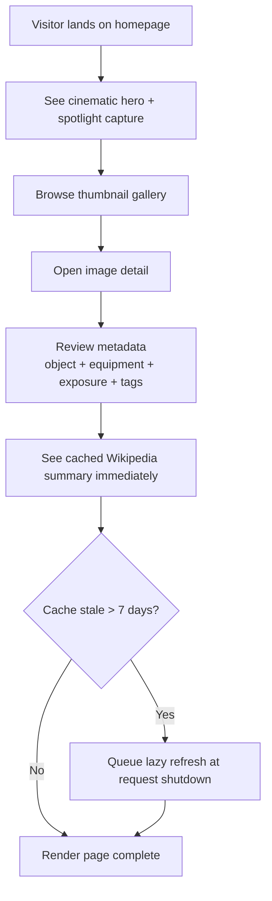
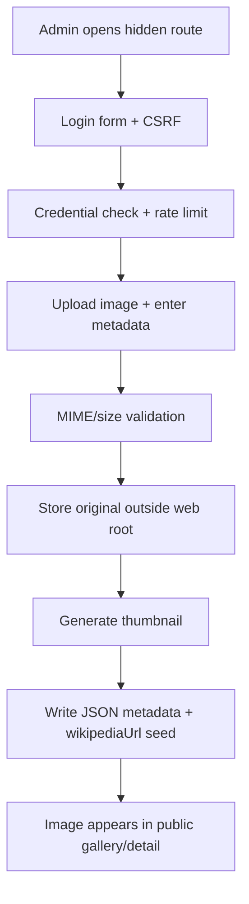
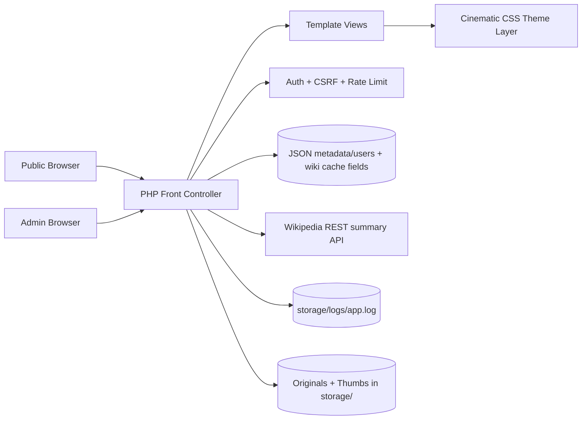

# images

Astronomy image showcase website with a public gallery and a secure admin upload backdoor, implemented with PHP + JSON storage for quick deployment on Apache.

## Project status

**Current maturity:** MVP+ visual polish implemented and runnable locally.

Implemented now:
- public gallery and image detail pages
- cinematic dark-sky visual treatment with starfield texture, spotlight hero card, and glassmorphism-style panels
- ambient micro-interactions (hover lift/glow, metadata chips, richer card transitions)
- Repository intentionally does not include bundled `.jpg` sample images; upload your own media through the admin flow.
- metadata display (capture, equipment, exposure, processing, tags)
- Wikipedia-enriched object context with cached summary fields (`wikipediaUrl`, `wikiTitle`, `wikiExtract`, `wikiThumbnail`, `wikiFetchedAt`, `wikiStatus`) and lazy stale refresh on detail-page access
- secure admin route with session auth, CSRF protection, and basic login rate limiting
- image upload pipeline with MIME/size validation and thumbnail generation

Planned next:
- richer filtering/search, editing/deleting uploads, and stronger production hardening.

## Runtime/build assumptions

- Linux environment
- PHP 7.4+ with GD enabled
- Apache (`mod_rewrite`) or PHP built-in dev server
- Writable `storage/` directory

## Local development

```bash
cd /workspace/images
php -S 0.0.0.0:8080 -t public public/index.php
```

Then open `http://localhost:8080`.

## Apache configuration (recommended)

Use `public/` as the Apache document root so that `storage/` is never directly web-accessible.

```apache
<VirtualHost *:80>
    ServerName images.local
    DocumentRoot /var/www/images/public

    <Directory /var/www/images/public>
        Options -Indexes +FollowSymLinks
        AllowOverride None
        Require all granted

        RewriteEngine On
        RewriteCond %{REQUEST_FILENAME} !-f
        RewriteCond %{REQUEST_FILENAME} !-d
        RewriteRule ^ index.php [QSA,L]
    </Directory>

    # Optional runtime overrides
    SetEnv ADMIN_ROUTE /hidden-admin
    SetEnv SITE_NAME "Night Sky Atlas"
    SetEnv MAX_UPLOAD_BYTES 10485760

    ErrorLog ${APACHE_LOG_DIR}/images-error.log
    CustomLog ${APACHE_LOG_DIR}/images-access.log combined
</VirtualHost>
```

Enable required modules/sites and reload Apache:

```bash
sudo a2enmod rewrite
sudo a2ensite images.conf
sudo systemctl reload apache2
```

If you deploy behind HTTPS, keep the same `DocumentRoot` and route all HTTP traffic to HTTPS at the Apache or load-balancer layer.

### Default admin access (change immediately)

- Route: `/hidden-admin/login`
- Username: `admin`
- Password: `change-me-now`

You can override route and limits via env vars:
- `ADMIN_ROUTE` (default `/hidden-admin`)
- `SITE_NAME` (default `Night Sky Atlas`)
- `MAX_UPLOAD_BYTES` (default `10485760`)

## Security notes (admin/backdoor)

- Admin route is hidden but also protected with real authentication.
- Passwords are stored as `password_hash` values (bcrypt).
- CSRF token required on login and upload forms.
- Basic per-IP login throttling is enforced.
- Uploads accept only JPEG/PNG/WebP and enforce max-size limit.
- Uploaded files are stored outside the public web root and served through `media.php`.

## Folder/file map

- `public/index.php` — front controller/router for public + admin routes.
- `public/src/bootstrap.php` — shared helpers, auth, upload + thumbnail logic.
- `public/src/views/` — HTML view templates.
- `public/assets/style.css` — cinematic dark UI styling and interaction polish.
- `storage/data/images.json` — image metadata records (including Wikipedia cache fields).
- `storage/logs/app.log` — background/lazy refresh failure logs for non-fatal runtime issues.
- `storage/data/users.json` — admin credential hashes.
- `WEBSITE_TASKS.md` — implementation tracker.
- `CODEX_PARALLEL_TASKS.md` — parallel work planning.

## User-facing flow



## Admin upload flow



## High-level architecture



## Wikipedia cache behavior

- `wikipediaUrl` is captured from admin upload (or seeded data in `images.json`).
- Detail pages always render cached Wikipedia fields first; page rendering never waits on live API calls.
- If `wikiFetchedAt` is older than 7 days (or missing), refresh is queued as a lazy background task at PHP shutdown.
- On fetch failure, existing cached title/extract/thumbnail values are preserved, `wikiStatus` is set to `error`, and the failure is logged to `storage/logs/app.log`.

## Keeping docs in sync (required)

For every behavior change in this repository:
1. Update `README.md` in the same commit.
2. Update Mermaid diagrams if flow/architecture changed.
3. Update `WEBSITE_TASKS.md` status/notes as relevant.
4. Document new env vars, operational assumptions, and security behavior.

A behavior-changing code diff without matching docs updates is incomplete.
