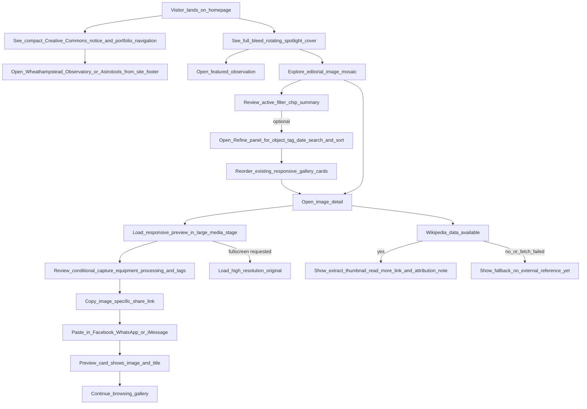
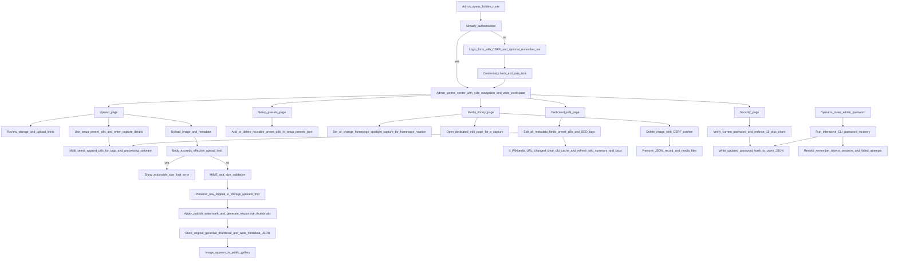
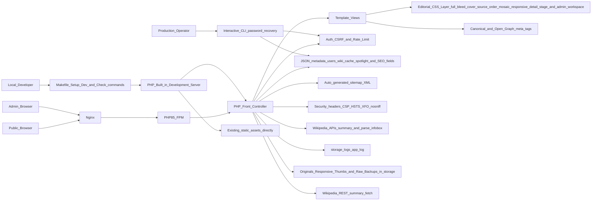

# images

Astronomy image showcase website with a public gallery and a secure admin upload backdoor, implemented with PHP + JSON storage for deployment on Nginx and PHP-FPM.

## Project status

**Current maturity:** MVP+ with an art-directed public experience, secure admin tooling, and a reproducible local workflow.

Implemented now:
- public gallery and image detail pages
- image-first editorial design with a full-bleed rotating spotlight cover, near-black observatory palette, H-alpha/OIII spectral accents, restrained portfolio masthead, and source-order-preserving mosaic gallery
- dynamic gallery rhythm that alternates wide, square, panoramic, and paired compositions on desktop while resolving to predictable two-column/tablet and single-column/mobile layouts
- persistent editorial card captions plus keyboard-accessible exposure/equipment reveals; hover image movement and all ambient effects respect reduced-motion settings
- client-side filtering now reorders the original server-rendered cards instead of rebuilding them, preserving responsive `srcset`, semantic markup, focus behavior, and image loading hints
- image-first detail pages with a large cinematic media stage, conditional semantic capture/equipment/processing groups, supporting object notes, and a stacked mobile experience
- detail pages load the responsive thumbnail first and request the potentially large original only when the fullscreen control is used
- Repository intentionally does not include bundled `.jpg` sample images; upload your own media through the admin flow.
- metadata display (capture, object type, structured equipment setup incl. scope type/telescope/mount/camera/filter chain, exposure, processing, tags)
- homepage keeps the existing latest/featured/daily spotlight rotation while presenting it as the cover artwork rather than a small dashboard card
- filters now default to a low-prominence chip summary under the hero, while full controls live behind a Refine toggle (object type/tag/date-range/text search + sort) and still sync via shareable query-parameter state.
- public navigation no longer exposes the hidden admin route; studio navigation appears only inside authenticated/admin pages
- secure admin route with session auth, CSRF protection, basic login rate limiting, task-based admin portal pages (upload/setup presets/media/security), in-session password change controls, and authenticated image deletion
- interactive CLI password recovery that hides terminal input, updates the admin hash atomically, revokes remember-me tokens and sessions, and clears failed-login throttling without placing a password in shell history
- redesigned admin control center UX with a dedicated side navigation rail, top-of-workspace guided help cards, and wider content panels so uploads/presets/library/security actions are easier to discover and use on desktop screens.
- admin media library now supports spotlight selection plus navigation into a dedicated edit page for full metadata + SEO updates (with preset pills available while editing).
- image upload pipeline with MIME/size validation, thumbnail generation, and admin-side storage-capacity visibility
- upload pipeline now preserves a raw backup copy in `storage/uploads/tmp`, stamps a configurable attribution watermark on the published original derivative, and generates both 800w and 400w JPEG thumbnails for responsive gallery `srcset`
- watermark rendering now prefers a script-like TrueType font (configurable) for attribution text, while safely falling back to GD bitmap text when TTF support/font files are unavailable
- added a public Contact page and auto-generated `/sitemap.xml` route for discoverability; placeholder email/social destinations are intentionally not published, while the footer and Contact page cross-link the live Wheathampstead Observatory and Astrotools projects
- legacy `.php` public URLs (`/about.php`, `/contact.php`, `/index.php`) now 301-redirect to canonical pretty routes so existing shared links keep working after route cleanup.
- baseline hardening headers are now emitted for every response (CSP, HSTS on HTTPS, X-Frame-Options, X-Content-Type-Options, and Referrer-Policy)
- admin setup-preset management for one-click upload/edit pills across observatory gear + metadata (scope type/object type/telescope/mount/camera/filter wheel/filters/filter set/processing software/tags)
- admin setup-preset changes now persist correctly to `setup_presets.json` for all categories, eliminating PHP notices during preset saves.
- graceful oversize-upload handling that reports when server (`post_max_size` / `upload_max_filesize`) or app (`MAX_UPLOAD_BYTES`) limits reject a request before PHP can parse form fields
- graceful storage-write error handling in admin actions (setup presets across all categories and uploads) when `storage/data` is not writable, avoiding PHP warnings exposed to users
- setup-preset validation errors are now category-aware (not hard-coded to scope type), so invalid/empty entries report the selected preset type.
- Wikipedia URL normalization uses PHP 7.4-compatible string checks (no PHP 8-only helpers) to avoid runtime fatals on older deployments.
- Wikipedia HTTP response parsing uses the current PHP header API when available and a PHP 7.4-compatible fallback without emitting PHP 8.5 deprecation notices.
- social preview tags on detail pages now point to the generated 800x500 JPEG thumbnail (instead of full original) to improve WhatsApp/Facebook card rendering reliability.
- global Creative Commons messaging is now surfaced in top-of-page notice, homepage hero copy, detail attribution text, About page content, and footer copy so image licensing is unambiguous site-wide.
- About page expanded into a long-form astrophotography learning resource with narrative instruction, inline workflow/imaging-train diagrams, and embedded reference imagery to better teach practical capture technique.
- About page now includes a categorized external resource directory (guides, forums, planning tools, processing software, apps, and inspiration links) with card-based styling for faster learning-path navigation.

Planned next:
- continue production hardening (filter/search + client-side sorting now available on homepage with shareable query-parameter URLs).

## Runtime/build assumptions

- Linux environment
- PHP 8.5 with GD enabled in production (PHP 7.4+ remains supported for local development)
- Nginx with PHP-FPM in production, or PHP built-in dev server locally
- Writable `storage/` directory (the app now persists PHP sessions in `storage/sessions` to keep CSRF/session state stable across environments)
- Writable `storage/uploads/tmp` directory (stores preserved pre-watermark originals for admin/operator recovery)

## Local development

This repository includes a native macOS/Linux development workflow. PHP 7.4+ is
supported; PHP with the `fileinfo`, `gd`, `json`, `mbstring`, `openssl`, and
`session` extensions is required.

```bash
git clone https://github.com/smeird/images.git
cd images
make setup
make dev
```

Then open `http://127.0.0.1:8080`. `make setup` creates a gitignored `.env`
from `.env.example`, verifies the PHP runtime/extensions, and prepares writable
runtime directories. Edit `.env` to change the local address, port, site name,
admin route, upload limit, or watermark settings.

Fast validation is available without starting the web server:

```bash
make check       # PHP syntax and committed JSON data
make lint        # PHP syntax only
make data-check  # committed JSON data only
```

If the production admin password is lost, recover it from an interactive server
terminal. The utility requires a unique password of at least 12 characters,
hides both prompts, and never accepts the password as a command-line argument:

```bash
cd /var/www/images
sudo php scripts/reset_admin_password.php
```

The recovery command updates the `admin` account, revokes remembered devices and
active sessions, and clears the failed-login throttle. Reload the login route in
a fresh tab after it completes.

The development server enables full PHP error reporting and lets PHP serve
existing static assets directly before routing application URLs through the
front controller. It is for local use only and must not be exposed as a
production server.

## Updating the production server

Code changes for this personal site are normally validated and pushed directly
to `main`. On the production server, replace `/var/www/images` below if the
checkout lives elsewhere, then run:

```bash
cd /var/www/images
git status --short
git pull --ff-only origin main
make check
sudo systemctl reload php8.5-fpm nginx
```

The status check is intentional: `storage/data/*.json` contains live mutable
application data. If it reports changes, keep them and resolve any pull conflict
instead of resetting or overwriting the production copy. A PHP-only code update
usually does not require a reload, but the reload safely refreshes PHP-FPM
workers and Nginx configuration where enabled.

## Nginx/PHP 8.5 production configuration

The supported production configuration is versioned in `deploy/images.nginx.conf`
and `deploy/images-fpm.conf`. It uses `public/` as the Nginx document root,
keeps `storage/` outside the public path, limits request bodies to 160 MB, and
aligns PHP upload/session paths with the writable storage tree. Install these
files as the Nginx site and PHP 8.5-FPM pool respectively, then reload both
services after validating the configuration.

## Apache configuration (recommended)

Use `public/` as the Apache document root so that `storage/` is never directly web-accessible.

```apache
<VirtualHost *:80>
    ServerName images.local
    DocumentRoot /var/www/images/public

    <Directory /var/www/images/public>
        Options -Indexes +FollowSymLinks
        AllowOverride None
        Require all granted

        RewriteEngine On
        RewriteCond %{REQUEST_FILENAME} !-f
        RewriteCond %{REQUEST_FILENAME} !-d
        RewriteRule ^ index.php [QSA,L]
    </Directory>

    # Optional runtime overrides
    SetEnv ADMIN_ROUTE /hidden-admin
    SetEnv SITE_NAME "Night Sky Atlas"
    SetEnv MAX_UPLOAD_BYTES 157286400

    # Keep Apache/PHP body limits aligned for large uploads
    php_value upload_max_filesize 150M
    php_value post_max_size 150M

    ErrorLog ${APACHE_LOG_DIR}/images-error.log
    CustomLog ${APACHE_LOG_DIR}/images-access.log combined
</VirtualHost>
```

Enable required modules/sites and reload Apache:

```bash
sudo a2enmod rewrite
sudo a2ensite images.conf
sudo systemctl reload apache2
```

If you deploy behind HTTPS, keep the same `DocumentRoot` and route all HTTP traffic to HTTPS at the Apache or load-balancer layer.

### Default admin access (change immediately)

- Route: `/hidden-admin/login`
- Username: `admin`
- Password: `change-me-now`
- After logging in, use the **Security** task page to rotate credentials.

You can override route and limits via env vars:
- `ADMIN_ROUTE` (default `/hidden-admin`)
- `SITE_NAME` (default `Night Sky Atlas`)
- `MAX_UPLOAD_BYTES` (default `157286400`, i.e., 150MB)
- `UPLOAD_WATERMARK_TEXT` (default `Smeird Astro`)
- `UPLOAD_WATERMARK_ANCHOR` (default `bottom-left`, supports `bottom-right`)
- `UPLOAD_WATERMARK_PADDING` (default `16` px inset)
- `UPLOAD_WATERMARK_FONT_PATH` (default `/usr/share/fonts/truetype/dejavu/DejaVuSansMono-Oblique.ttf`; set to any readable `.ttf`/`.otf` path to change the script-style watermark font)
- `upload_max_filesize` and `post_max_size` (PHP ini/virtual-host values; should be >= `MAX_UPLOAD_BYTES`)

## Security notes (admin/backdoor)

- Admin route is hidden but also protected with real authentication.
- Passwords are stored as `password_hash` values (bcrypt) and can be rotated from the authenticated admin area.
- A lost password can be replaced with `sudo php scripts/reset_admin_password.php`; the CLI-only recovery path hides input, preserves credential-file permissions, revokes sessions/tokens, and clears failed attempts.
- Admin login supports an optional 30-day remember-me device cookie; tokens are stored server-side as SHA-256 hashes, rotated after auto-login, and revoked on logout/password change.
- Visiting the admin login URL while already authenticated now redirects directly to the admin upload page, avoiding accidental “logged out” confusion when opening `/hidden-admin/login` in an existing session.
- CSRF token required on login, upload, delete, and password-change forms, backed by file-based PHP sessions in `storage/sessions` to avoid token mismatches when default system session paths are unavailable.
- Basic per-IP login throttling is enforced.
- Uploads accept only JPEG/PNG/WebP and enforce max-size limit; effective limit is the minimum of `MAX_UPLOAD_BYTES`, `upload_max_filesize`, and `post_max_size`.
- Uploaded display originals receive a subtle attribution watermark during publish processing; a raw pre-watermark copy is retained under `storage/uploads/tmp`.
- Watermark text uses GD TrueType rendering when available (for script-like font styling) and gracefully falls back to bitmap text if a configured font path is missing/unreadable.
- Wikipedia URLs are restricted to `wikipedia.org/wiki/...` article links and fetched server-side for preview + public detail enrichment.
- Wikipedia panel includes attribution/license note, optional infobox-derived key facts (size/shape/distance-style fields), and graceful fallback when external fetch is unavailable.
- Uploaded files are stored outside the public web root and served through `media.php`.
- Wikipedia metadata fetches only allow trusted Wikipedia hosts (`en.wikipedia.org` plus optional language subdomains) and return structured error codes for UI-safe fallbacks.
- Social preview URLs are generated from request host/scheme headers, so production deployments should keep trusted proxy/host header handling correctly configured.
- Open Graph image metadata now includes type + dimensions so social crawlers can parse previews more consistently.
- The app emits defense-in-depth HTTP headers on all routes (CSP, X-Frame-Options, X-Content-Type-Options, Referrer-Policy, and HSTS on HTTPS).
- Admin metadata editor validates required fields and Wikipedia URLs before persisting updates; if the Wikipedia URL changes, cached wiki summary/facts are reset and refreshed so references stay in sync.

## Folder/file map

- `public/index.php` — front controller/router for public + admin routes; passes existing static files through when running under PHP's built-in server.
- `public/src/bootstrap.php` — shared helpers, auth, upload + thumbnail logic, publish watermarking, and security-header helper.
- `public/src/views/` — HTML view templates.
- `public/src/views/contact.php` — placeholder-free public contact/collaboration landing page with editorial links to Wheathampstead Observatory conditions and Astrotools.
- `public/src/views/home.php` — image-first spotlight cover, responsive editorial gallery markup, and URL-synced filtering/sorting that reorders existing cards without discarding responsive image attributes.
- `public/src/services/wikipedia.php` — Wikipedia URL validation + metadata normalization helper service.
- `public/assets/style.css` — editorial public-site system, responsive gallery mosaic, image-first detail presentation, admin styling, and reduced-motion behavior.
- `storage/data/images.json` — image metadata records (including Wikipedia cache fields, spotlight flag, and editable SEO meta tags).
- `storage/sessions/` — file-backed PHP session storage used for admin auth + CSRF continuity.
- `storage/uploads/tmp/` — preserved raw originals before publish watermarking.
- `storage/logs/app.log` — background/lazy refresh failure logs for non-fatal runtime issues.
- `scripts/regenerate_thumbnails.php` — maintenance script for rebuilding 800w + 400w JPEG thumbs and syncing metadata fields.
- `scripts/reset_admin_password.php` — interactive, history-safe production admin password recovery and session revocation.
- `scripts/setup.sh` — validates the local PHP toolchain and prepares gitignored writable runtime directories.
- `scripts/dev.sh` — loads local `.env` settings and starts the PHP development server.
- `scripts/check.sh` — runs fast PHP syntax and JSON integrity checks.
- `Makefile` — short commands for setup, development, and validation.
- `.env.example` — documented, non-secret local environment defaults; copy to gitignored `.env`.
- `.editorconfig` — shared whitespace and encoding defaults for compatible editors.
- `storage/data/users.json` — admin credential hashes.
- `storage/data/setup_presets.json` — reusable setup preset pills (scope type, object type, telescope, mount, camera, filter wheel, filters, filter set, processing software, tags) for admin upload/edit workflows.
- `storage/data/scope_types.json` — legacy scope-type preset store still read for backward compatibility.
- `WEBSITE_TASKS.md` — implementation tracker.
- `LANDING_PAGE_INSPIRATION.md` — landing-page benchmark patterns and implementation-ready layout options.
- `CODEX_PARALLEL_TASKS.md` — parallel work planning.

## User-facing flow


```mermaid
flowchart TD
  Visitor_lands_on_homepage --> See_full_bleed_rotating_spotlight_cover
  Visitor_lands_on_homepage --> See_compact_Creative_Commons_notice_and_portfolio_navigation
  See_compact_Creative_Commons_notice_and_portfolio_navigation --> Open_Wheathampstead_Observatory_or_Astrotools_from_site_footer
  See_full_bleed_rotating_spotlight_cover --> Open_featured_observation
  See_full_bleed_rotating_spotlight_cover --> Explore_editorial_image_mosaic
  Explore_editorial_image_mosaic --> Review_active_filter_chip_summary
  Review_active_filter_chip_summary -->|optional| Open_Refine_panel_for_object_tag_date_search_and_sort
  Open_Refine_panel_for_object_tag_date_search_and_sort --> Reorder_existing_responsive_gallery_cards
  Reorder_existing_responsive_gallery_cards --> Open_image_detail
  Explore_editorial_image_mosaic --> Open_image_detail
  Open_image_detail --> Load_responsive_preview_in_large_media_stage
  Load_responsive_preview_in_large_media_stage --> Review_conditional_capture_equipment_processing_and_tags
  Load_responsive_preview_in_large_media_stage -->|fullscreen requested| Load_high_resolution_original
  Review_conditional_capture_equipment_processing_and_tags --> Copy_image_specific_share_link
  Copy_image_specific_share_link --> Paste_in_Facebook_WhatsApp_or_iMessage
  Paste_in_Facebook_WhatsApp_or_iMessage --> Preview_card_shows_image_and_title
  Preview_card_shows_image_and_title --> Continue_browsing_gallery
  Open_image_detail --> Wikipedia_data_available
  Wikipedia_data_available -->|yes| Show_extract_thumbnail_read_more_link_and_attribution_note
  Wikipedia_data_available -->|no_or_fetch_failed| Show_fallback_no_external_reference_yet
```

## Admin upload flow


```mermaid
flowchart TD
  Admin_opens_hidden_route --> Already_authenticated
  Already_authenticated -->|yes| Admin_control_center_with_side_navigation_and_wide_workspace
  Already_authenticated -->|no| Login_form_with_CSRF_and_optional_remember_me
  Login_form_with_CSRF_and_optional_remember_me --> Credential_check_and_rate_limit
  Credential_check_and_rate_limit --> Admin_control_center_with_side_navigation_and_wide_workspace
  Admin_control_center_with_side_navigation_and_wide_workspace --> Upload_page
  Admin_control_center_with_side_navigation_and_wide_workspace --> Setup_presets_page
  Admin_control_center_with_side_navigation_and_wide_workspace --> Media_library_page
  Admin_control_center_with_side_navigation_and_wide_workspace --> Dedicated_edit_page
  Admin_control_center_with_side_navigation_and_wide_workspace --> Security_page
  Upload_page --> Review_storage_and_upload_limits
  Upload_page --> Use_setup_preset_pills_and_enter_capture_details
  Use_setup_preset_pills_and_enter_capture_details --> Multi_select_append_pills_for_tags_and_processing_software
  Upload_page --> Upload_image_and_metadata
  Upload_image_and_metadata --> Body_exceeds_effective_upload_limit
  Body_exceeds_effective_upload_limit -->|yes| Show_actionable_size_limit_error
  Body_exceeds_effective_upload_limit -->|no| MIME_and_size_validation
  MIME_and_size_validation --> Preserve_raw_original_in_storage_uploads_tmp
  Preserve_raw_original_in_storage_uploads_tmp --> Apply_publish_watermark_and_generate_responsive_thumbnails
  Apply_publish_watermark_and_generate_responsive_thumbnails --> Store_original_generate_thumbnail_and_write_metadata_JSON
  Store_original_generate_thumbnail_and_write_metadata_JSON --> Image_appears_in_public_gallery
  Setup_presets_page --> Add_or_delete_reusable_preset_pills_in_setup_presets_json
  Media_library_page --> Set_or_change_homepage_spotlight_capture_for_homepage_rotation
  Media_library_page --> Open_dedicated_edit_page_for_a_capture
  Dedicated_edit_page --> Edit_all_metadata_fields_preset_pills_and_SEO_tags
  Edit_all_metadata_fields_preset_pills_and_SEO_tags --> Multi_select_append_pills_for_tags_and_processing_software
  Edit_all_metadata_fields_preset_pills_and_SEO_tags --> If_Wikipedia_URL_changed_clear_old_cache_and_refresh_wiki_summary_and_facts
  Media_library_page --> Delete_image_with_CSRF_confirm
  Delete_image_with_CSRF_confirm --> Remove_JSON_record_and_media_files
  Security_page --> Verify_current_password_and_enforce_12_plus_chars
  Verify_current_password_and_enforce_12_plus_chars --> Write_updated_password_hash_to_users_JSON
  Operator_loses_admin_password --> Run_interactive_CLI_password_recovery
  Run_interactive_CLI_password_recovery --> Write_updated_password_hash_to_users_JSON
  Run_interactive_CLI_password_recovery --> Revoke_remember_tokens_sessions_and_failed_attempts
```

## High-level architecture


```mermaid
graph LR
  Public_Browser --> Nginx
  Admin_Browser --> Nginx
  Nginx --> PHP85_FPM
  PHP85_FPM --> PHP_Front_Controller
  PHP_Front_Controller --> Template_Views
  Template_Views --> Editorial_CSS_Layer_full_bleed_cover_source_order_mosaic_responsive_detail_stage_and_admin_workspace
  Template_Views --> Canonical_and_Open_Graph_meta_tags
  PHP_Front_Controller --> Auth_CSRF_and_Rate_Limit
  PHP_Front_Controller --> JSON_metadata_users_wiki_cache_spotlight_and_SEO_fields
  PHP_Front_Controller --> Auto_generated_sitemap_XML
  PHP_Front_Controller --> Security_headers_CSP_HSTS_XFO_nosniff
  PHP_Front_Controller --> Wikipedia_APIs_summary_and_parse_infobox
  PHP_Front_Controller --> storage_logs_app_log
  PHP_Front_Controller --> Originals_Responsive_Thumbs_and_Raw_Backups_in_storage
  PHP_Front_Controller --> Wikipedia_REST_summary_fetch
  Local_Developer --> Makefile_Setup_Dev_and_Check_commands
  Production_Operator --> Interactive_CLI_password_recovery
  Interactive_CLI_password_recovery --> JSON_metadata_users_wiki_cache_spotlight_and_SEO_fields
  Interactive_CLI_password_recovery --> Auth_CSRF_and_Rate_Limit
  Makefile_Setup_Dev_and_Check_commands --> PHP_Built_in_Development_Server
  PHP_Built_in_Development_Server --> Existing_static_assets_directly
  PHP_Built_in_Development_Server --> PHP_Front_Controller
```

## Wikipedia cache behavior

- `wikipediaUrl` is captured from admin upload (or seeded data in `images.json`).
- Detail pages always render cached Wikipedia fields first; page rendering never waits on live API calls.
- If `wikiFetchedAt` is older than 7 days (or missing), refresh is queued as a lazy background task at PHP shutdown.
- On fetch failure, existing cached title/extract/thumbnail/key-fact values are preserved, `wikiStatus` is set to `error`, and the failure is logged to `storage/logs/app.log`.
- When an admin changes a record's Wikipedia URL, cached wiki title/extract/thumbnail/key facts are immediately invalidated and a fresh fetch is attempted during the same save operation.

## Keeping docs in sync (required)

For every behavior change in this repository:
1. Update `README.md` in the same commit.
2. Update Mermaid diagrams if flow/architecture changed.
3. Update `WEBSITE_TASKS.md` status/notes as relevant.
4. Document new env vars, operational assumptions, and security behavior.

A behavior-changing code diff without matching docs updates is incomplete.

Owner workflow: after validation, requested site updates may be committed and
pushed directly to `main`; include the production `git pull --ff-only` handoff
command with each update unless the owner requests a PR-based workflow.
