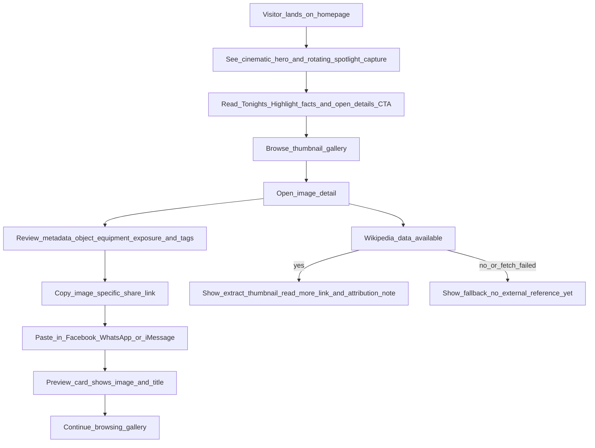
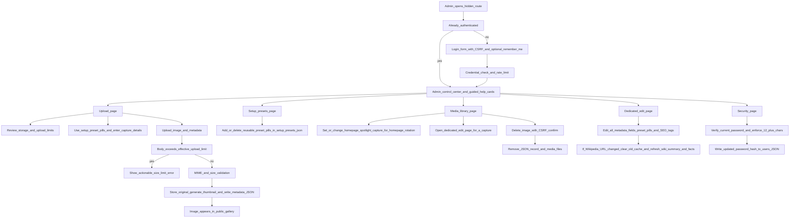
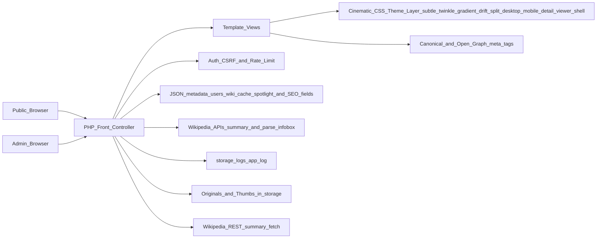

# images

Astronomy image showcase website with a public gallery and a secure admin upload backdoor, implemented with PHP + JSON storage for quick deployment on Apache.

## Project status

**Current maturity:** MVP+ visual polish implemented and runnable locally.

Implemented now:
- public gallery and image detail pages
- cinematic dark-sky visual treatment with starfield texture, rotating spotlight hero card rules (latest/featured/daily deterministic date hash), and glassmorphism-style panels
- ambient micro-interactions (hover lift/glow, metadata chips, richer card transitions, and subtle hero twinkle/gradient drift that respects reduced-motion settings)
- detail viewer now has explicit split responsive experiences: widescreen desktop layout (expanded media canvas + a widened side metadata/Wikipedia column for readability) and a stacked long-form mobile layout tuned for narrow screens.
- image detail fullscreen pill is anchored at the top-right of the image for quicker access before scrolling metadata
- Repository intentionally does not include bundled `.jpg` sample images; upload your own media through the admin flow.
- metadata display (capture, object type, structured equipment setup incl. scope type/telescope/mount/camera/filter chain, exposure, processing, tags)
- homepage filter toolbar with object type/tag/date-range/text search + client-side sort controls (newest/oldest/exposure/title) backed by embedded JSON payload and query-param state persistence for shareable gallery URLs
- secure admin route with session auth, CSRF protection, basic login rate limiting, task-based admin portal pages (upload/setup presets/media/security), in-session password change controls, and authenticated image deletion
- redesigned admin control center UX with guided task cards, clearer navigation labels, and inline help so uploads/presets/library/security actions are easier to discover.
- admin media library now supports spotlight selection plus navigation into a dedicated edit page for full metadata + SEO updates (with preset pills available while editing).
- image upload pipeline with MIME/size validation, thumbnail generation, and admin-side storage-capacity visibility
- admin setup-preset management for one-click upload pills across observatory gear (scope type/object type/telescope/mount/camera/filter wheel/filters/filter set)
- admin setup-preset changes now persist correctly to `setup_presets.json` for all categories, eliminating PHP notices during preset saves.
- graceful oversize-upload handling that reports when server (`post_max_size` / `upload_max_filesize`) or app (`MAX_UPLOAD_BYTES`) limits reject a request before PHP can parse form fields
- graceful storage-write error handling in admin actions (setup presets across all categories and uploads) when `storage/data` is not writable, avoiding PHP warnings exposed to users
- setup-preset validation errors are now category-aware (not hard-coded to scope type), so invalid/empty entries report the selected preset type.
- Wikipedia URL normalization uses PHP 7.4-compatible string checks (no PHP 8-only helpers) to avoid runtime fatals on older deployments.
- social preview tags on detail pages now point to the generated 800x500 JPEG thumbnail (instead of full original) to improve WhatsApp/Facebook card rendering reliability.

Planned next:
- continue production hardening (filter/search + client-side sorting now available on homepage with shareable query-parameter URLs).

## Runtime/build assumptions

- Linux environment
- PHP 7.4+ with GD enabled
- Apache (`mod_rewrite`) or PHP built-in dev server
- Writable `storage/` directory (the app now persists PHP sessions in `storage/sessions` to keep CSRF/session state stable across environments)

## Local development

```bash
cd /workspace/images
php -S 0.0.0.0:8080 -t public public/index.php
```

Then open `http://localhost:8080`.

## Apache configuration (recommended)

Use `public/` as the Apache document root so that `storage/` is never directly web-accessible.

```apache
<VirtualHost *:80>
    ServerName images.local
    DocumentRoot /var/www/images/public

    <Directory /var/www/images/public>
        Options -Indexes +FollowSymLinks
        AllowOverride None
        Require all granted

        RewriteEngine On
        RewriteCond %{REQUEST_FILENAME} !-f
        RewriteCond %{REQUEST_FILENAME} !-d
        RewriteRule ^ index.php [QSA,L]
    </Directory>

    # Optional runtime overrides
    SetEnv ADMIN_ROUTE /hidden-admin
    SetEnv SITE_NAME "Night Sky Atlas"
    SetEnv MAX_UPLOAD_BYTES 157286400

    # Keep Apache/PHP body limits aligned for large uploads
    php_value upload_max_filesize 150M
    php_value post_max_size 150M

    ErrorLog ${APACHE_LOG_DIR}/images-error.log
    CustomLog ${APACHE_LOG_DIR}/images-access.log combined
</VirtualHost>
```

Enable required modules/sites and reload Apache:

```bash
sudo a2enmod rewrite
sudo a2ensite images.conf
sudo systemctl reload apache2
```

If you deploy behind HTTPS, keep the same `DocumentRoot` and route all HTTP traffic to HTTPS at the Apache or load-balancer layer.

### Default admin access (change immediately)

- Route: `/hidden-admin/login`
- Username: `admin`
- Password: `change-me-now`
- After logging in, use the **Security** task page to rotate credentials.

You can override route and limits via env vars:
- `ADMIN_ROUTE` (default `/hidden-admin`)
- `SITE_NAME` (default `Night Sky Atlas`)
- `MAX_UPLOAD_BYTES` (default `157286400`, i.e., 150MB)
- `upload_max_filesize` and `post_max_size` (PHP ini/virtual-host values; should be >= `MAX_UPLOAD_BYTES`)

## Security notes (admin/backdoor)

- Admin route is hidden but also protected with real authentication.
- Passwords are stored as `password_hash` values (bcrypt) and can be rotated from the authenticated admin area.
- Admin login supports an optional 30-day remember-me device cookie; tokens are stored server-side as SHA-256 hashes, rotated after auto-login, and revoked on logout/password change.
- Visiting the admin login URL while already authenticated now redirects directly to the admin upload page, avoiding accidental “logged out” confusion when opening `/hidden-admin/login` in an existing session.
- CSRF token required on login, upload, delete, and password-change forms, backed by file-based PHP sessions in `storage/sessions` to avoid token mismatches when default system session paths are unavailable.
- Basic per-IP login throttling is enforced.
- Uploads accept only JPEG/PNG/WebP and enforce max-size limit; effective limit is the minimum of `MAX_UPLOAD_BYTES`, `upload_max_filesize`, and `post_max_size`.
- Wikipedia URLs are restricted to `wikipedia.org/wiki/...` article links and fetched server-side for preview + public detail enrichment.
- Wikipedia panel includes attribution/license note, optional infobox-derived key facts (size/shape/distance-style fields), and graceful fallback when external fetch is unavailable.
- Uploaded files are stored outside the public web root and served through `media.php`.
- Wikipedia metadata fetches only allow trusted Wikipedia hosts (`en.wikipedia.org` plus optional language subdomains) and return structured error codes for UI-safe fallbacks.
- Social preview URLs are generated from request host/scheme headers, so production deployments should keep trusted proxy/host header handling correctly configured.
- Open Graph image metadata now includes type + dimensions so social crawlers can parse previews more consistently.
- Admin metadata editor validates required fields and Wikipedia URLs before persisting updates; if the Wikipedia URL changes, cached wiki summary/facts are reset and refreshed so references stay in sync.

## Folder/file map

- `public/index.php` — front controller/router for public + admin routes.
- `public/src/bootstrap.php` — shared helpers, auth, upload + thumbnail logic.
- `public/src/views/` — HTML view templates.
- `public/src/views/home.php` now embeds homepage image JSON payload for client-side filtering/sorting without full-page reloads.
- `public/src/services/wikipedia.php` — Wikipedia URL validation + metadata normalization helper service.
- `public/assets/style.css` — cinematic dark UI styling and interaction polish.
- `storage/data/images.json` — image metadata records (including Wikipedia cache fields, spotlight flag, and editable SEO meta tags).
- `storage/sessions/` — file-backed PHP session storage used for admin auth + CSRF continuity.
- `storage/logs/app.log` — background/lazy refresh failure logs for non-fatal runtime issues.
- `storage/data/users.json` — admin credential hashes.
- `storage/data/setup_presets.json` — reusable setup preset pills (scope type, object type, telescope, mount, camera, filter wheel, filters, filter set) for admin uploads.
- `storage/data/scope_types.json` — legacy scope-type preset store still read for backward compatibility.
- `WEBSITE_TASKS.md` — implementation tracker.
- `CODEX_PARALLEL_TASKS.md` — parallel work planning.

## User-facing flow



## Admin upload flow



## High-level architecture



## Wikipedia cache behavior

- `wikipediaUrl` is captured from admin upload (or seeded data in `images.json`).
- Detail pages always render cached Wikipedia fields first; page rendering never waits on live API calls.
- If `wikiFetchedAt` is older than 7 days (or missing), refresh is queued as a lazy background task at PHP shutdown.
- On fetch failure, existing cached title/extract/thumbnail/key-fact values are preserved, `wikiStatus` is set to `error`, and the failure is logged to `storage/logs/app.log`.
- When an admin changes a record's Wikipedia URL, cached wiki title/extract/thumbnail/key facts are immediately invalidated and a fresh fetch is attempted during the same save operation.

## Keeping docs in sync (required)

For every behavior change in this repository:
1. Update `README.md` in the same commit.
2. Update Mermaid diagrams if flow/architecture changed.
3. Update `WEBSITE_TASKS.md` status/notes as relevant.
4. Document new env vars, operational assumptions, and security behavior.

A behavior-changing code diff without matching docs updates is incomplete.
